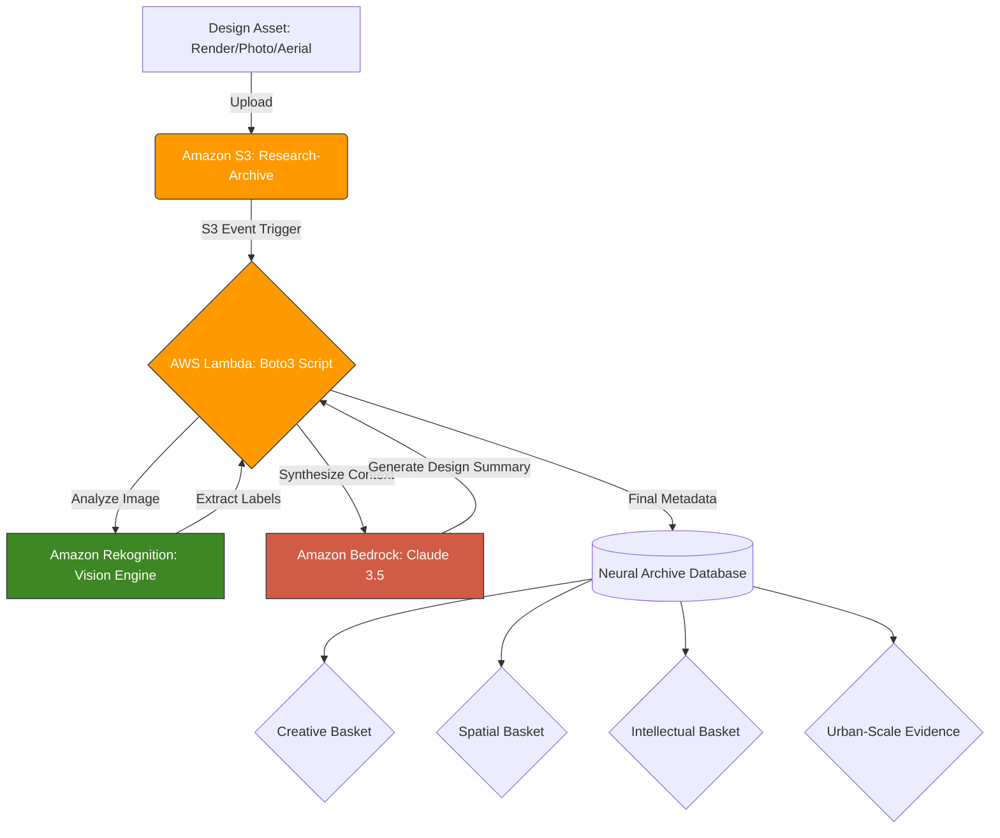

# AI-KORP | Neural Asset Archives
**Applied Research: Investigating automated design taxonomies using AWS cloud infrastructure for AEC and Branding.**

---

## 1. Executive Summary

This repository serves as a technical log for a proof-of-concept study. The objective is to evaluate how cloud-native AI services can transition static architectural and branding archives into "Active Knowledge Bases."

By utilizing a serverless pipeline, we move from manual filing to a system that "understands" architectural intent, material composition, and brand application.

This research has been extended to urban scale, investigating how brand and architecture are already fused in the logistics landscape of Germany — and what that means for any generative AI system trained on aerial imagery of the built environment.

A preprint based on this research is deposited at Zenodo:
**Mate, K. (2026). Sorting the Harvest at Scale: A Governance Framework for Generative AI, from Brand Systems to Urban Futures. Zenodo. https://doi.org/10.5281/zenodo.21460708**

---

## 2. Theoretical Framework: The AI-KORP Baskets

This study operationalizes the **AI-KORP Framework**, specifically focusing on the **Intellectual (Knowledge)** and **Spatial (Context)** baskets.

- **Input:** Raw design assets (Renders, Brand Mockups, Site Photos, Aerial Imagery).
- **Process:** AWS-driven extraction of visual and contextual metadata.
- **Output:** A searchable, tagged ecosystem for design synthesis.

The framework organises AI tools along two axes:

- **Basket axis:** Creative · Spatial · Intellectual · Process
- **Ripeness axis:** Sourcing ○ · Sorting ◐ · Stored ●

Ripeness evaluates not what a tool can generate, but what sovereignty, verification, and disclosure conditions must be satisfied before its output is treated as design or planning authority.

---

## 3. The Technical Stack (AWS)

To ensure professional data sovereignty, the pipeline is built on a modular, private cloud environment:

| Service | Role |
| :--- | :--- |
| **Amazon S3** | Object storage for high-resolution design assets. |
| **AWS Lambda** | Event-driven logic to trigger analysis on upload. |
| **Amazon Rekognition** | Computer vision for label detection (Materials, Objects, Styles). |
| **Amazon Bedrock** | LLM reasoning to synthesize raw tags into design summaries. |

---

## 4. Visual Study & Analysis

Below are the sample inputs used to test the pipeline's granularity:

### Asset A: Brand Archetype
*Testing text detection and graphic consistency.*

### Asset B: Spatial Context (Industrial Workshop)
*Testing complex environment recognition (Gantries, Concrete, Workflow).*

---

## 5. Compliance & Governance

This research is conducted with a "Security-First" mindset:

- **Data Privacy:** All processing occurs within a private VPC.
- **Ethics:** Aligned with the **EU AI Act (Regulation EU 2024/1689)** regarding transparent data processing and human-in-the-loop verification.
- **Article 4:** AI literacy obligations — the AI-KORP Ripeness axis operationalizes this at practitioner level.
- **Article 50:** Disclosure obligations — applied here to classification and generative outputs at both building and urban scale.

### 🔍 Live Audit: Machine Perception

I analyzed the primary workshop render using **Amazon Rekognition** to extract a spatial taxonomy.

**Top High-Confidence Labels:**

* **Architecture:** 99.9%
* **Factory / Industrial Building:** 99.9%
* **Person:** 98.6% (Validating human scale)
* **Manufacturing:** 72.8%

**Raw Data Archive:**

Download the verified architectural taxonomy: [Master Label List (JSON)](./Asset_2_Rekognition_Raw.json)

---

## 6. Urban-Scale Extension: Brand-Architecture Fusion in the Logistics Landscape

This section extends the proof-of-concept from a single building to the branded logistics landscape of Germany, testing whether the brand-architecture fusion observed at building scale is visible and legible at aerial and urban scale.

### Research Question

If a generative or classification AI system is trained on aerial imagery of logistics infrastructure, what brand signals does it inherit — and are those signals governed or disclosed?

### Evidence: Aerial Imagery Survey

Six logistics and retail facilities were surveyed using Google Earth aerial and oblique imagery (capture dates: 2023–2025). All locations are publicly observable built environment. Imagery is cited by facility name, region, and capture date per Google's attribution terms and is not redistributed in this repository.

| Facility | Brand | Fusion Type | Signal Carrier |
| :--- | :--- | :--- | :--- |
| DHL Parcel Center Osterweddingen | DHL | Type A — Fleet-carried | Yellow trailers, neutral envelope |
| DHL Zustellbasis Münster-Nord | DHL | Type A — Fleet-carried | Yellow trailers, neutral envelope |
| KiK Logistik GmbH, Bönen | KiK | Type B — Envelope-carried | Red facade and roof |
| IKEA Dortmund | IKEA | Type B — Envelope-carried | Blue/yellow envelope, roof lettering |
| PENNY Zentrallager, Cologne | PENNY | Type A — Fleet-carried | Red trucks, neutral envelope |
| EDEKA Logistik Oberhausen | EDEKA | Type C — Hybrid | Architectural envelope + brand mark |

### Brand-Architecture Fusion Typology

Three distinct strategies are observable from aerial imagery alone:

**Type A — Fleet-carried brand signal, neutral envelope**
The building envelope is generic infrastructure. The brand signal is carried entirely by the operational layer — vehicles, trailers, loading equipment. A generative system trained on this imagery learns to associate fleet colour with logistics typology without ever processing a logo.

**Type B — Envelope-carried brand signal**
The building itself is the brand medium. Colour and mark are applied at architectural scale, readable from altitude without fleet present. A generative system learns brand colour as architectural language.

**Type C — Hybrid**
Architectural ambition in the envelope combined with brand mark applied at urban-legible scale. The building operates simultaneously as architecture and brand infrastructure.

### Governance Implication

In all three types, brand and architecture are fused before any classifier or generative system touches the imagery. The fusion is not introduced by the AI — it is inherited from the built environment itself. Any credible governance framework for generative urbanism must account for this prior condition: what the training data already contains, before generation begins.

This is the urban-scale equivalent of the Ripeness question applied at building scale in Section 5: not what the system can generate, but what conditions exist in the data before generation is permitted.

### Generated Visuals

Schematic visuals illustrating the three fusion types — using fictional brand colour systems to avoid trade dress reproduction — are generated using Google Gemini Imagen and stored in `/urban-scale-evidence/generated-visuals/`. No real brand trade dress is reproduced in these images.

### Coordinates and Attribution

| Facility | Coordinates | Capture Date |
| :--- | :--- | :--- |
| DHL Parcel Center Osterweddingen | 52°02'58.79"N 11°35'37.63"E | 4/7/2025 |
| KiK Logistik GmbH Bönen | 51°36'35.58"N 7°46'50.82"E | 4/4/2025 |
| IKEA Dortmund | 51°29'34.96"N 7°22'08.01"E | 5/28/2023 |
| PENNY Zentrallager Cologne | 50°58'40.95"N 6°50'37.21"E | - |
| EDEKA Logistik Oberhausen | 51°31'29.40"N 6°49'05.14"E | - |

*All coordinates extracted from Google Earth camera metadata visible in screenshots. Imagery © Google, used for non-commercial research purposes with attribution per Google's geoguidelines.*

---

## System Architecture

To ensure professional-grade security, the pipeline is built on a modular AWS environment. This "sandboxed" approach ensures that design assets remain private and are excluded from public AI training loops.

---

*Note: This is a non-commercial research project exploring workflow optimisation for the AEC and Brand Design sectors. Extended in 2026 to urban-scale investigation of brand-architecture fusion in logistics infrastructure.*

*Kaushambi Mate · Independent Researcher · ORCID: https://orcid.org/0009-0008-5892-3576*
