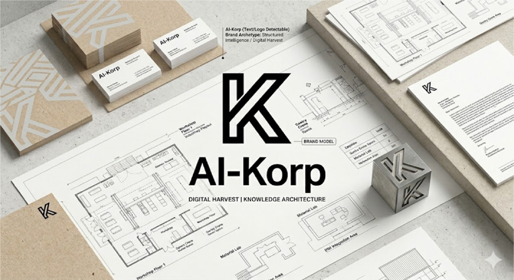
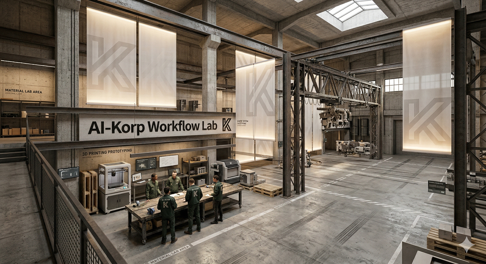

# AI-KORP | Neural Asset Archives
**Applied Research: Investigating automated design taxonomies using AWS cloud infrastructure for AEC and Branding.**

## 1. Executive Summary
This repository serves as a technical log for a proof-of-concept study. The objective is to evaluate how cloud-native AI services can transition static architectural and branding archives into "Active Knowledge Bases."

By utilizing a serverless pipeline, we move from manual filing to a system that "understands" architectural intent, material composition, and brand application.

## 2. Theoretical Framework: The AI-KORP Baskets
This study operationalizes the **AI-KORP Framework**, specifically focusing on the **Intellectual (Knowledge)** and **Spatial (Context)** baskets. 

- **Input:** Raw design assets (Renders, Brand Mockups, Site Photos).
- **Process:** AWS-driven extraction of visual and contextual metadata.
- **Output:** A searchable, tagged ecosystem for design synthesis.

## 3. The Technical Stack (AWS)
To ensure professional data sovereignty, the pipeline is built on a modular, private cloud environment:

| Service | Role |
| :--- | :--- |
| **Amazon S3** | Object storage for high-resolution design assets. |
| **AWS Lambda** | Event-driven logic to trigger analysis on upload. |
| **Amazon Rekognition** | Computer vision for label detection (Materials, Objects, Styles). |
| **Amazon Bedrock** | LLM reasoning to synthesize raw tags into design summaries. |

## 4. Visual Study & Analysis
Below are the sample inputs used to test the pipeline's granularity:

### Asset A: Brand Archetype
*Testing text detection and graphic consistency.*

### Asset B: Spatial Context (Industrial Workshop)
*Testing complex environment recognition (Gantries, Concrete, Workflow).*

## 5. Compliance & Governance
This research is conducted with a "Security-First" mindset:
- **Data Privacy:** All processing occurs within a private VPC.
- **Ethics:** Aligned with the **EU AI Act** regarding transparent data processing and human-in-the-loop verification.

Download the raw architectural taxonomy extracted from the AI-Korp Workshop render: [Master Label List (CSV)](./AmazonRekognitionAllLabels_v3.0.csv)
---
*Note: This is a non-commercial research project exploring workflow optimization for the AEC and Brand Design sectors.*
