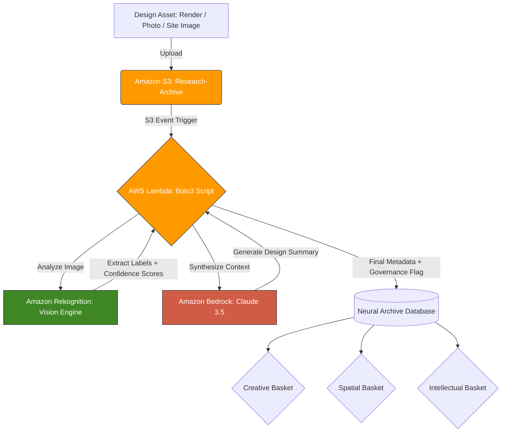

# Neural Asset Archives

This folder documents the core proof-of-concept pipeline of the AI-KORP 
research: the conversion of static architectural and branding assets into 
an active, queryable knowledge base using AWS cloud infrastructure.

The Neural Asset Archives is the applied technical layer of the AI-KORP 
framework. It tests whether cloud-native AI services can extract meaningful 
design intelligence from raw visual assets — renders, brand mockups, site 
photographs — and return structured, searchable metadata that supports 
design synthesis and governance decisions.

---

## What This Is

A serverless classification pipeline built on AWS, ingesting design assets 
and returning:

- **Visual labels** — objects, materials, spatial typologies, architectural 
  elements identified by machine vision
- **Confidence scores** — numerical weighting of each label, used to 
  evaluate classifier reliability and ripeness
- **Design summaries** — LLM-synthesised narratives contextualising the 
  raw label output within architectural and brand design language
- **Governance flags** — where classification confidence, data provenance, 
  or disclosure conditions are insufficient to treat output as design authority

This pipeline operationalises the **Ripeness axis** of the AI-KORP framework:

| Ripeness Level | Symbol | Condition |
| :--- | :---: | :--- |
| Sourcing | ○ | Asset ingested, not yet classified |
| Sorting | ◐ | Classification complete, human review pending |
| Stored | ● | Verified, disclosed, cleared for design use |

No asset moves from Sorting to Stored without human-in-the-loop review.

---

## Pipeline Architecture

---

## Folder Structure

neural-asset-archives/
├── README.md
└── classification-pipeline/
    └── industrial-workshop-test/
        ├── README.md
        ├── Asset_1_Branding.jpg
        ├── Asset_2_Rekognition_Raw.json
        ├── Asset_2_Spatial.jpg
        ├── Asset_3_Material.jpg
        ├── metadata_sample.json
        └── results/ 

---

## Assets Tested

### Asset A: Brand Archetype
**File:** `Asset_1_Branding.jpg`
**Basket:** Creative
**Test objective:** Text detection, graphic consistency, brand mark recognition.
**Ripeness outcome:** Sorting ◐ — classifier identifies graphic and typographic 
elements but cannot verify data provenance or licensing status of training 
corpus. Human review required before design use.

---

### Asset B: Spatial Context — Industrial Workshop
**File:** `Asset_2_Spatial.jpg`
**Basket:** Spatial + Intellectual
**Test objective:** Complex environment recognition — gantries, concrete, 
workflow, human scale.
**Ripeness outcome:** Stored ● — high-confidence classification across 
architectural, industrial, and human-scale labels. Results verified and 
disclosed. See classification-pipeline/industrial-workshop-test/ for full 
methodology and raw JSON output.

**Top Rekognition labels:**

| Label | Confidence |
| :--- | :--- |
| Architecture | 99.9% |
| Factory / Industrial Building | 99.9% |
| Person | 98.6% |
| Manufacturing | 72.8% |

---

## Key Finding

Brand and architecture are not two separate signal layers in the built 
environment. At building scale, a company's colour, mark, and typographic 
system travel identically from logo to facade to fleet. The classifier 
learns from that fused layer whether or not the learning is governed.

This finding, established at building scale through the Neural Asset Archives 
pipeline, is extended to urban and aerial scale in the Urban-Scale Evidence 
section of this repository.

---

## Governance and Compliance

All processing occurs within a private AWS VPC. No assets are submitted to 
public AI training loops. Research is conducted in alignment with:

- **EU AI Act, Article 4** — AI literacy: the Ripeness axis operationalises 
  practitioner-level literacy requirements
- **EU AI Act, Article 50** — Disclosure: all classification and generative 
  outputs are flagged with their Ripeness status before design use
- **Data sovereignty:** Assets remain within the researcher's private cloud 
  environment throughout the pipeline

---

## Related Publication

This pipeline is documented as the methods section of:

**Mate, K. (2026). Sorting the Harvest at Scale: A Governance Framework 
for Generative AI, from Brand Systems to Urban Futures. Zenodo. 
https://doi.org/10.5281/zenodo.21460708**

Intended for submission to the Special Issue *Generative Urbanisms: 
Artificial Intelligence and the Design of Urban Futures*, Architectural 
Intelligence (Springer Nature). Submission deadline: 30 November 2026.

---

*Kaushambi Mate · Independent Researcher · 
ORCID: https://orcid.org/0009-0008-5892-3576*
