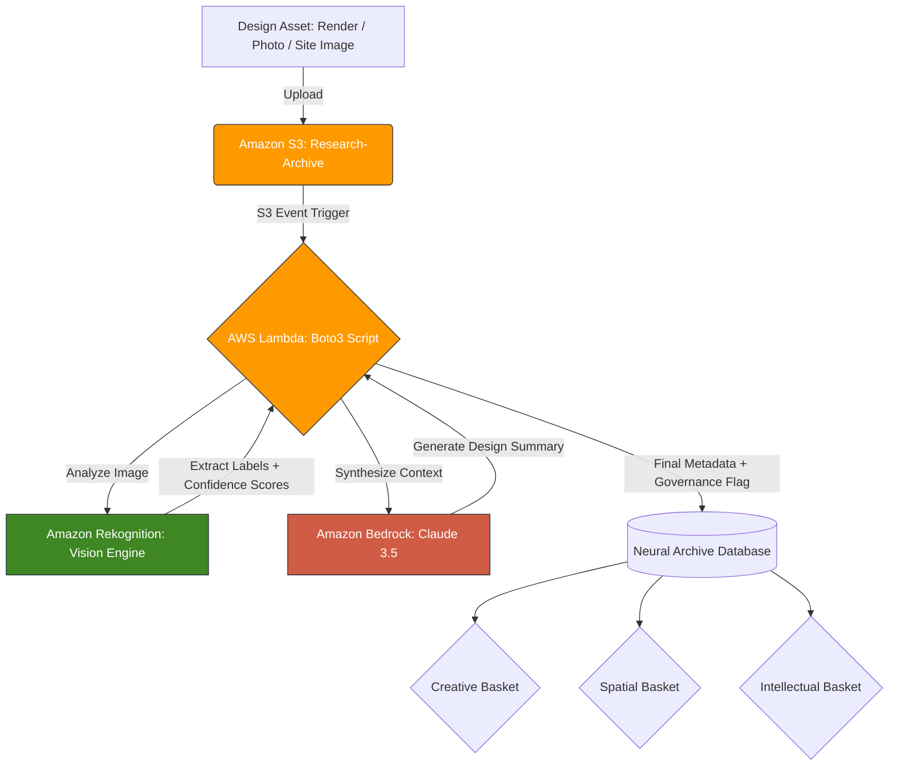

# Neural Asset Archives

This folder documents the core proof-of-concept pipeline of the AI-KORP 
research: the conversion of static architectural and branding assets into 
an active, queryable knowledge base using AWS cloud infrastructure.

The Neural Asset Archives is the applied technical layer of the AI-KORP 
framework. It tests whether cloud-native AI services can extract meaningful 
design intelligence from raw visual assets — renders, brand mockups, site 
photographs — and return structured, searchable metadata that supports 
design synthesis and governance decisions.

**Status note:** the three assets below were classified individually through 
the Amazon Rekognition console (Label Detection tool). The S3 → Lambda → 
Bedrock stages shown in the architecture diagram represent the intended 
automated pipeline; the Bedrock synthesis step has not yet been run against 
these assets, and this README does not claim otherwise.

---

## What This Is

A classification workflow tested against AWS Rekognition, returning:

- **Visual labels** — objects, materials, spatial typologies, architectural 
  elements identified by machine vision
- **Confidence scores** — numerical weighting of each label, used to 
  evaluate classifier reliability and ripeness
- **Governance flags** — where classification confidence, data provenance, 
  or disclosure conditions are insufficient to treat output as design authority

Planned but not yet executed against these assets:

- **Design summaries** — LLM-synthesised narratives (Amazon Bedrock) 
  contextualising raw label output within architectural and brand design 
  language
- **Automated ingestion** — S3 upload trigger and Lambda orchestration, 
  as shown in the architecture diagram below

This pipeline operationalises the **Ripeness axis** of the AI-KORP framework:

| Ripeness Level | Symbol | Condition |
| :--- | :---: | :--- |
| Sourcing | ○ | Asset ingested, not yet classified |
| Sorting | ◐ | Classification complete, human review pending |
| Stored | ● | Verified, disclosed, cleared for design use |

No asset moves from Sorting to Stored without human-in-the-loop review.

---

## Pipeline Architecture (proposed)

This diagram shows the pipeline's intended end-to-end architecture. The 
Rekognition stage (D) has been executed manually via the console for the 
three assets documented below; S3 ingestion, Lambda orchestration, and 
Bedrock synthesis (B, C, E) have not yet been run.

---

## Folder Structure
