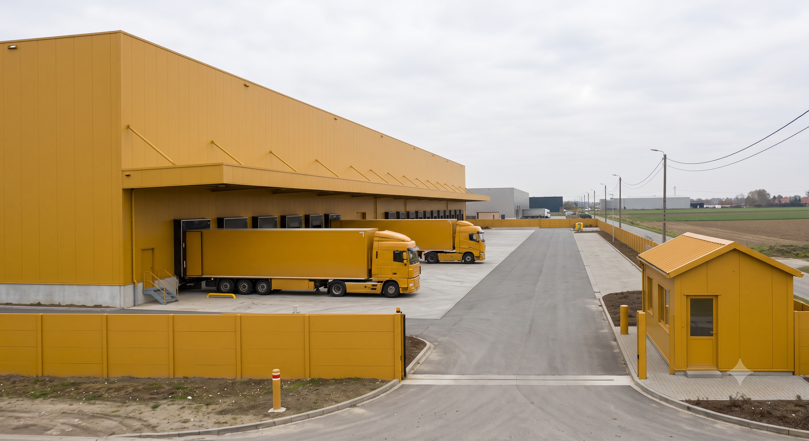
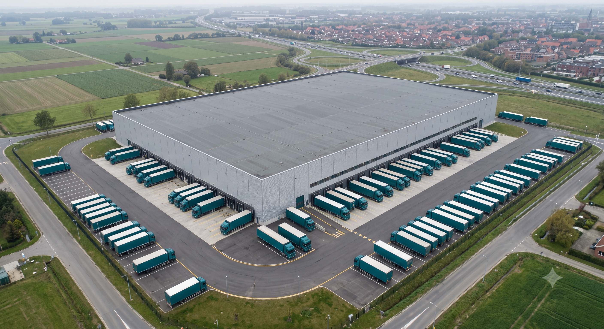
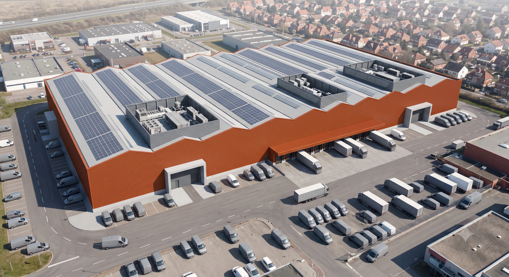
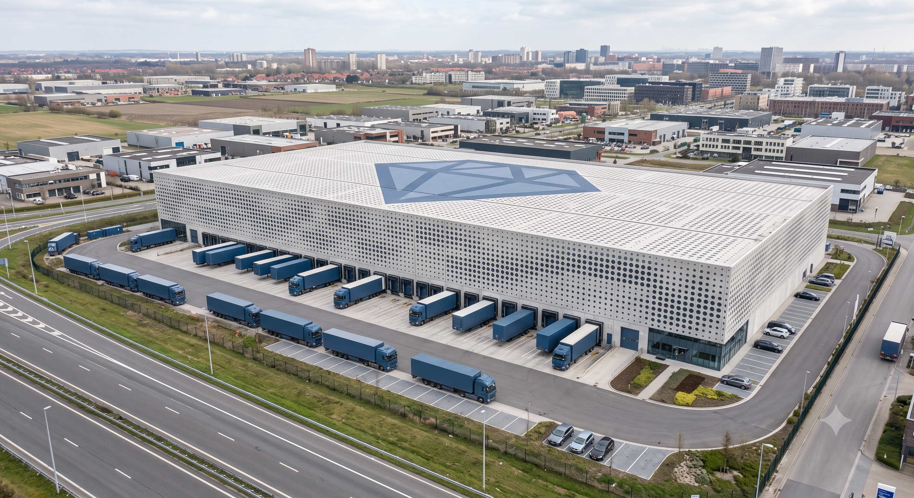

# Urban-Scale Evidence: Generated Visuals

This folder contains AI-generated schematic visuals illustrating the three 
brand-architecture fusion types identified in the aerial imagery survey 
documented in the main repository README.

All visuals are generated using Google Gemini Imagen (2026). No real brand 
trade dress, logo, colour system, or typographic identity is reproduced. 
Fictional colour systems are used throughout to illustrate the fusion 
mechanism without reference to any specific company.

---

## Purpose

These visuals serve as Figure 4 in the associated preprint:

**Mate, K. (2026). Sorting the Harvest at Scale: A Governance Framework 
for Generative AI, from Brand Systems to Urban Futures. Zenodo. 
https://doi.org/10.5281/zenodo.21460708**

The paper describes Figure 4 as:
> *Schematic (not photographic, to sidestep trademark-image-reproduction 
> issues) of a generic branded logistics corridor: storefront, distribution 
> centre, delivery vehicle, and hoarding sharing one colour system.*

---

## Fig. 4 — Generic Branded Logistics Corridor

**File:** `Fig4_branded_logistics_corridor.png`

Street-level perspective of a generic logistics corridor showing four 
elements sharing a single unified fictional ochre colour system: a 
distribution centre facade, delivery trucks at loading bays, a roadside 
hoarding, and an ancillary gatehouse. No logos, text, or recognisable 
brand marks. Colour alone performs all identification work.

*Fig. 4 — Schematic of a generic branded logistics corridor: facade, 
fleet, hoarding, and storefront sharing one fictional colour system. 
AI-generated using Google Gemini Imagen, 2026. No real brand trade dress 
reproduced.*

---

## Fusion Type Illustrations

### Type A — Fleet-carried brand signal, neutral envelope

**File:** `TypeA_fleet_carried.png`

A generic logistics distribution centre with a neutral grey building 
envelope. Brand signal carried entirely by delivery vehicles, trailers, 
and loading equipment in a unified deep teal. The building itself is 
unbranded. Colour alone in the fleet layer performs identification.

**Fictional colour:** Deep teal `#1A6B6B`

*Type A — Fleet-carried brand signal, neutral envelope. AI-generated 
using Google Gemini Imagen, 2026. No real brand trade dress reproduced.*

---

### Type B — Envelope-carried brand signal

**File:** `TypeB_envelope_carried.png`

A generic retail warehouse where the entire building — facade, roof, 
cladding, dock canopies — carries the brand signal in a unified burnt 
sienna. No fleet present. Readable from aerial altitude by colour alone.

**Fictional colour:** Burnt sienna `#C45E2A`

*Type B — Envelope-carried brand signal. AI-generated using Google Gemini 
Imagen, 2026. No real brand trade dress reproduced.*

---

### Type C — Hybrid envelope and fleet

**File:** `TypeC_hybrid.png`

An architecturally considered logistics centre combining a distinctive 
perforated concrete facade with a simplified geometric mark in slate blue 
applied at urban-legible scale. Fleet at loading docks carries the same 
colour. Both layers signal simultaneously.

**Fictional colour:** Slate blue `#3D5A80`

*Type C — Hybrid: envelope and fleet carry brand signal simultaneously. 
AI-generated using Google Gemini Imagen, 2026. No real brand trade dress 
reproduced.*

---

## Attribution and Reuse

All images in this folder were generated by the repository author using 
Google Gemini Imagen. The author places no restriction on non-commercial, 
attributed reuse of these images. Note that purely AI-generated imagery 
without substantial human creative modification may fall outside 
copyright protection under current US and EU law, so this note describes 
a permission to reuse rather than a formal copyright licence.

If reproduced in academic or professional work, cite as:

> Mate, K. (2026). Brand-architecture fusion typology — generated schematics 
> [AI-generated images]. GitHub. 
> https://github.com/archi-netizen/ai-korp-neural-archives

---

## Generation Notes

- Tool: Google Gemini Imagen
- Date: 2026
- All prompts designed to produce fictional, generic facilities
- No real-world facility, brand, or trade dress used as reference image
- Outputs reviewed by author before inclusion to confirm no recognisable 
  brand signal is present
- Fictional colours used: deep teal #1A6B6B · burnt sienna #C45E2A · 
  slate blue #3D5A80 · ochre #D4A017
